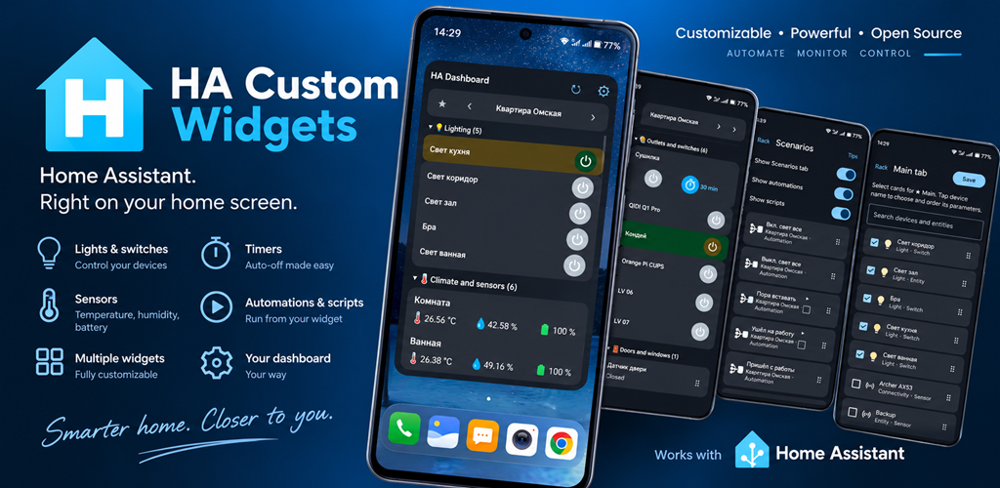
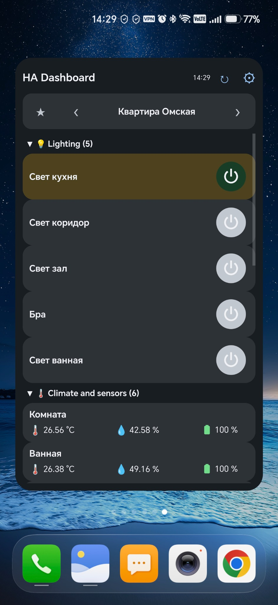
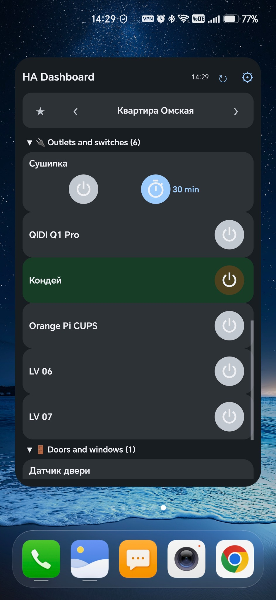
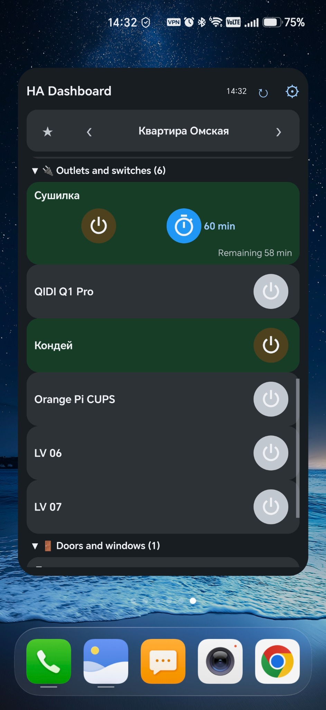
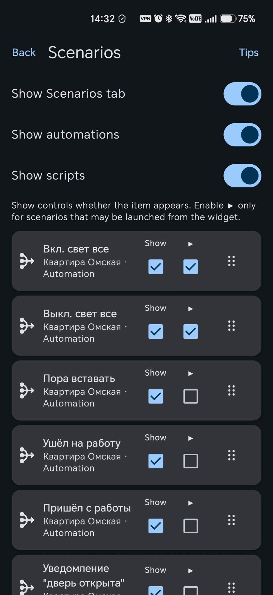
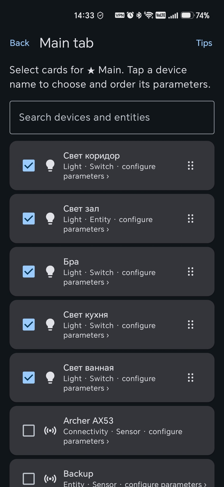
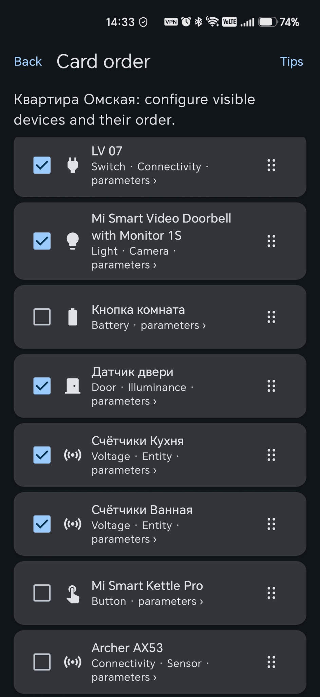

# HA Custom Widgets

<p align="center">
  
</p>

<p align="center">
  <a href="README.ru.md">Русская версия</a> · <a href="https://t.me/HACustomWidgets">Telegram community</a> · <a href="https://dannynov.github.io/HA-Custom-Widgets/privacy-policy/">Privacy Policy</a>
</p>

<p align="center">
  <a href="https://github.com/DannyNov/HA-Custom-Widgets/releases/latest"></a>
  <a href="https://github.com/DannyNov/HA-Custom-Widgets" title="Open the repository and click Star"></a>
  <a href="#requirements"></a>
  <a href="https://github.com/DannyNov/HA-Custom-Widgets/blob/main/LICENSE"></a>
  <a href="https://github.com/DannyNov/HA-Custom-Widgets/tree/main/app/src/main/java/com/danila/hacustomwidgets"></a>
  <a href="https://www.home-assistant.io/"></a>
</p>

<p align="center">
  
</p>

Native Android home-screen widgets for Home Assistant. Build a customizable dashboard with device controls, sensors, timers and scenarios. The app connects directly to the Home Assistant address configured by the user. Entity, device, area and floor names remain unchanged.

Russian system locales use the Russian interface. Every other locale uses English.

## Screenshots

<p align="center">
  
  
  
</p>
<p align="center">
  
  
  
</p>

## Features

- scrollable and resizable HA Dashboard widget;
- Main, Home Assistant space and Scenarios tabs;
- per-space grouping and manual ordering of spaces, groups, cards and metrics;
- individual card, metric, automation and script visibility;
- large power controls for primary `light` and `switch` entities;
- configurable Home Assistant auto-off timers, including 120-minute presets;
- colored temperature, humidity and battery indicators;
- automation enable/disable controls;
- optional manual automation and script launch button with separate progress, success and failure feedback;
- English and Russian app and widget interface;
- light and dark themes that follow Android;
- optional support through CloudTips or USDT (BEP-20 / TON).

Manual automation launch preserves its conditions (`skip_condition=false`). A disabled automation can still be launched manually once without enabling its automatic triggers. Green feedback confirms that Home Assistant accepted the call; it does not guarantee every physical consequence.

## Requirements

- Android 12 (API 31) or later;
- a Home Assistant instance reachable from the phone;
- a Home Assistant Long-Lived Access Token.

## Installation

1. Open the [latest GitHub Release](https://github.com/DannyNov/HA-Custom-Widgets/releases/latest) and download the APK (`HAWidgets-v*.apk`) from **Assets**.
2. Allow APK installation from the browser or file manager used to open it.
3. Install the APK and open **HA Custom Widgets**.
4. Enter the Home Assistant URL and Long-Lived Access Token, then select **Check and save**.
5. Touch and hold an empty area of the Android Home screen, open **Widgets**, find **HA Custom Widgets**, and drag **HA Dashboard** to the Home screen.
6. Configure the Dashboard and resize it as needed.

The gear icon in HA Dashboard opens that widget instance's settings directly. If multiple Dashboard widgets exist, each keeps its own configuration.

To update, install the newer APK over the existing version. Do not uninstall first if you want to preserve the app and widget configuration. Official release APKs use the same signing certificate.

## Real-time updates

The optional **Real-time** mode uses Android Notification access to keep the Home Assistant event channel available in the background. HA Custom Widgets does not read or use notification contents. Without this permission, manual refresh remains available and background updates operate on a best-effort basis.

## Security and privacy

- the Home Assistant token is encrypted with AES-GCM using Android Keystore;
- Android backup is disabled for application data;
- Home Assistant addresses and tokens are not stored in source code;
- the app contains no analytics or advertising SDK;
- signing material is provided only through GitHub Actions Secrets and is not stored in Git.

Prefer HTTPS for remote access and use a dedicated Home Assistant user with only the required permissions.

## Build from source

Requires JDK 17, Android SDK 35 and Gradle 8.9:

```bash
gradle testDebugUnitTest assembleDebug
```

The release workflow builds a non-debuggable signed APK and verifies its application ID, version, signing certificate and SHA-256 checksum.

## License

Copyright 2026 Danila Novikov. Licensed under the [Apache License 2.0](LICENSE). See [NOTICE](NOTICE) for attribution information.

## Community

- [Telegram channel and community](https://t.me/HACustomWidgets) — announcements, updates and discussion;
- [GitHub Issues](https://github.com/DannyNov/HA-Custom-Widgets/issues) — bug reports and feature requests.

Never publish a Home Assistant address, access token or other private configuration data.

## Support

Support is voluntary and is not payment for goods, services or additional features.

- [CloudTips](https://pay.cloudtips.ru/p/ab27592e)
- USDT (BNB Smart Chain / BEP-20): `0xe7FA8d9608d50e1B7C645D8185473BCE3A3c14Df`
- USDT (TON): `UQB2SAZRVJZIHu7hpNSIYHKUPhn_frtrlHITFw6CbQKrNk9c`

Send only USDT using the exact network shown.

## Disclaimer

HA Custom Widgets is an independent project and is not affiliated with or endorsed by the Home Assistant project or the Open Home Foundation.

## Auto-off timer

The app starts/restarts the linked HA timer and displays server state. Actual switch/light
shutdown requires an automation in Home Assistant for `timer.finished`. The app does not send
an automatic `turn_off` from the phone. Without that automation, timer expiry can leave the
switch ON. See [setup example](docs/TIMER_AUTO_OFF.md).
