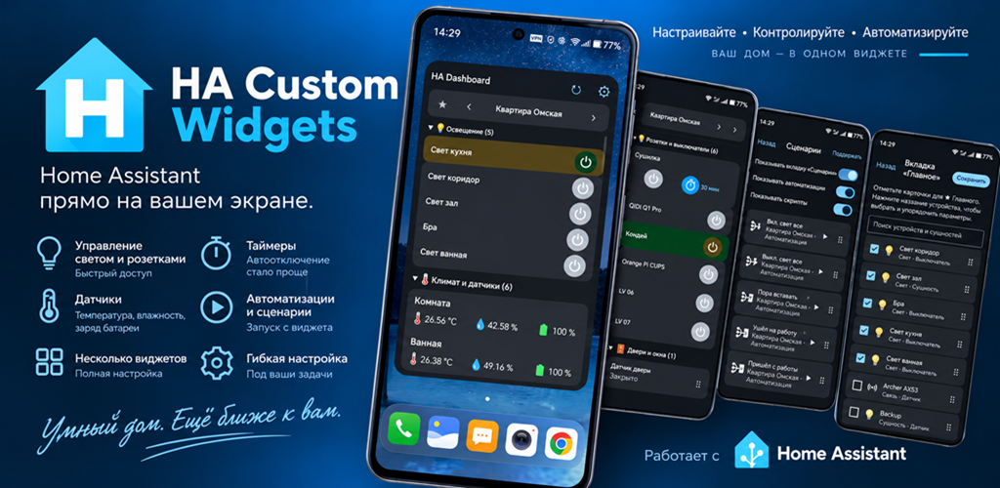
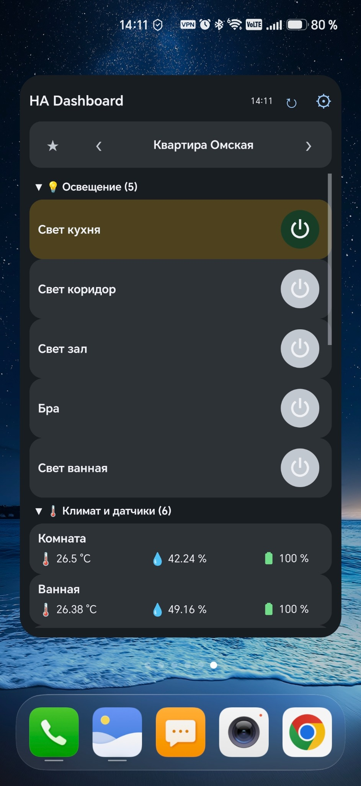
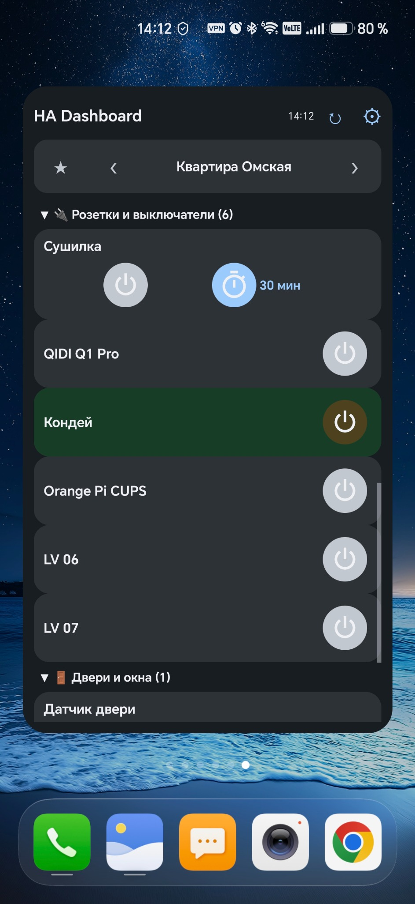
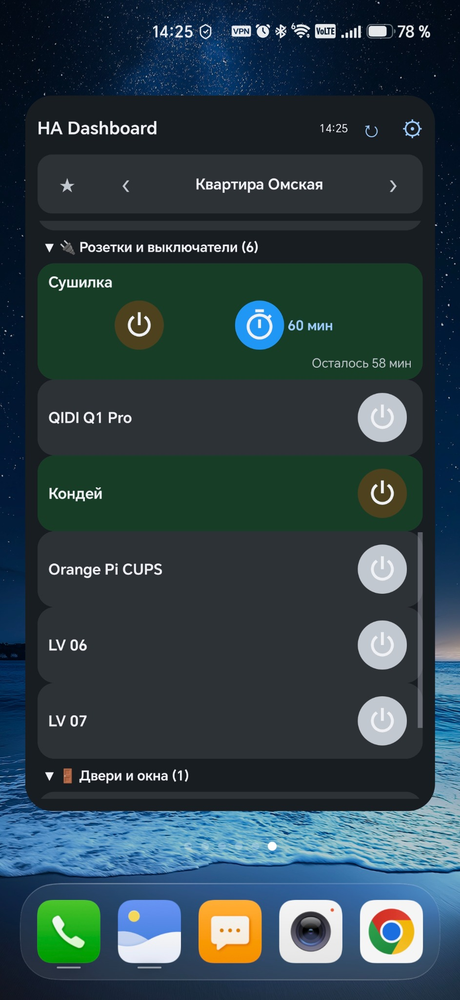
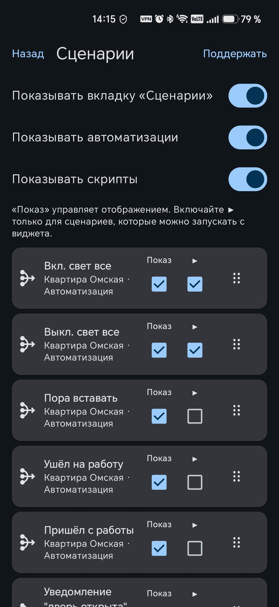
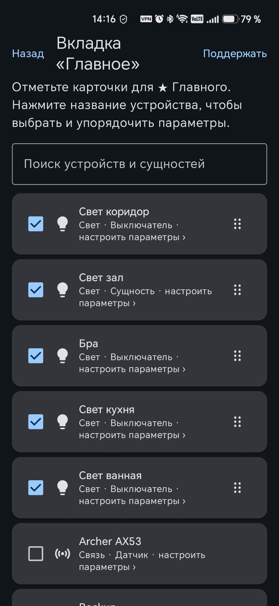
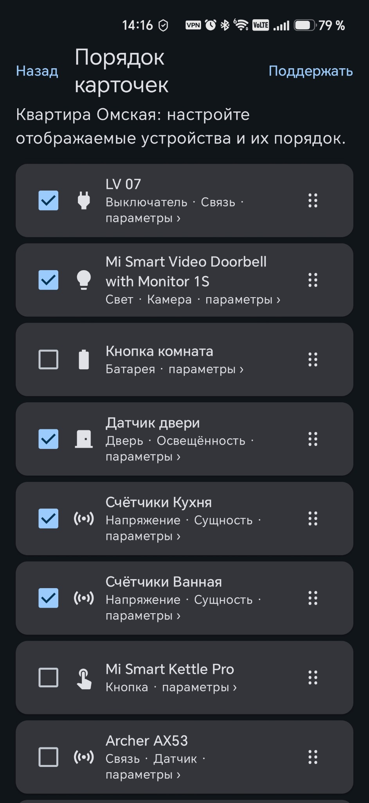

# HA Custom Widgets

<p align="center">
  
</p>

<p align="center">
  <a href="README.md">English version</a> · <a href="https://t.me/HACustomWidgets">Telegram-сообщество</a> · <a href="https://dannynov.github.io/HA-Custom-Widgets/privacy-policy/">Политика конфиденциальности</a>
</p>

<p align="center">
  <a href="https://github.com/DannyNov/HA-Custom-Widgets/releases/latest"></a>
  <a href="https://github.com/DannyNov/HA-Custom-Widgets" title="Open the repository and click Star"></a>
  
  <a href="https://github.com/DannyNov/HA-Custom-Widgets/blob/main/LICENSE"></a>
  
  
</p>

<p align="center">
  
</p>

Нативные виджеты Home Assistant для домашнего экрана Android. Создайте настраиваемый дашборд с управлением устройствами, датчиками, таймерами и сценариями. Приложение подключается напрямую к адресу Home Assistant, который указывает пользователь. Имена сущностей, устройств, помещений и этажей остаются такими, как их передаёт Home Assistant.

При русском языке системы интерфейс русский, при любом другом — английский.

## Скриншоты

<p align="center">
  
  
  
</p>
<p align="center">
  
  
  
</p>

## Возможности

- прокручиваемый HA Dashboard с изменяемым размером;
- вкладки «Главное», пространства Home Assistant и «Сценарии»;
- группировка и ручной порядок пространств, групп, карточек и параметров;
- индивидуальная видимость карточек, параметров, автоматизаций и скриптов;
- крупные кнопки питания основных сущностей `light` и `switch`;
- настраиваемые таймеры автоотключения Home Assistant, включая 120 минут;
- цветные индикаторы температуры, влажности и заряда батареи;
- включение и отключение автоматизаций;
- выборочный ручной запуск автоматизаций и скриптов с раздельной индикацией выполнения, успеха и ошибки;
- русский и английский интерфейс приложения и виджета;
- светлая и тёмная темы, следующие настройке Android;
- добровольная поддержка через CloudTips или USDT (BEP-20 / TON).

Ручной запуск автоматизации не обходит её условия (`skip_condition=false`). Выключенную автоматизацию можно выполнить вручную один раз, не включая её автоматические триггеры. Зелёная индикация подтверждает принятие команды Home Assistant, но не гарантирует все физические последствия команды.

## Требования

- Android 12 (API 31) или новее;
- доступный с телефона сервер Home Assistant;
- Long-Lived Access Token Home Assistant.

## Установка

1. Откройте [последний релиз на GitHub](https://github.com/DannyNov/HA-Custom-Widgets/releases/latest) и скачайте APK (`HAWidgets-v*.apk`) из раздела **Assets**.
2. Разрешите установку APK для браузера или файлового менеджера, из которого открываете файл.
3. Установите APK и откройте **HA Custom Widgets**.
4. Укажите адрес Home Assistant и Long-Lived Access Token, затем нажмите **«Проверить и сохранить»**.
5. Удерживайте пустое место на домашнем экране Android, откройте **«Виджеты»**, найдите **HA Custom Widgets** и перетащите **HA Dashboard** на домашний экран.
6. Настройте Dashboard и измените его размер при необходимости.

Шестерёнка в HA Dashboard сразу открывает настройки этого экземпляра виджета. Если создано несколько Dashboard, каждый сохраняет собственную конфигурацию.

Для обновления установите новый APK поверх существующей версии. Не удаляйте приложение перед обновлением, если хотите сохранить настройки приложения и виджетов. Официальные release APK подписываются одним сертификатом.

## Real-time обновления

Необязательный режим **Real-time** использует системный доступ к уведомлениям Android, чтобы канал событий Home Assistant мог работать в фоне. HA Custom Widgets не читает и не использует содержимое уведомлений. Без этого разрешения остаётся ручное обновление, а фоновые обновления работают в режиме best-effort.

## Безопасность и конфиденциальность

- токен Home Assistant шифруется AES-GCM с помощью Android Keystore;
- резервное копирование данных приложения средствами Android отключено;
- адреса и токены Home Assistant не хранятся в исходном коде;
- в приложении нет аналитики и рекламных SDK;
- материалы подписи передаются только через GitHub Actions Secrets и не хранятся в Git.

Для внешнего доступа предпочтителен HTTPS и отдельный пользователь Home Assistant только с необходимыми правами.

## Сборка из исходного кода

Требуются JDK 17, Android SDK 35 и Gradle 8.9:

```bash
gradle testDebugUnitTest assembleDebug
```

Release workflow собирает подписанный APK без `debuggable` и проверяет application ID, версию, сертификат подписи и контрольную сумму SHA-256.

## Лицензия

Copyright 2026 Danila Novikov. Проект распространяется по [Apache License 2.0](LICENSE). Сведения об авторстве находятся в [NOTICE](NOTICE).

## Сообщество

- [Telegram-канал и сообщество](https://t.me/HACustomWidgets) — новости, обновления и обсуждение;
- [GitHub Issues](https://github.com/DannyNov/HA-Custom-Widgets/issues) — сообщения об ошибках и предложения функций.

Не публикуйте адрес Home Assistant, токен доступа и другие данные личной конфигурации.

## Поддержать разработку

Перевод добровольный и не является оплатой товаров, услуг или дополнительных функций.

- [CloudTips](https://pay.cloudtips.ru/p/ab27592e)
- USDT (BNB Smart Chain / BEP-20): `0xe7FA8d9608d50e1B7C645D8185473BCE3A3c14Df`
- USDT (TON): `UQB2SAZRVJZIHu7hpNSIYHKUPhn_frtrlHITFw6CbQKrNk9c`

Отправляйте только USDT в точно указанной сети.

## Отказ от аффилированности

HA Custom Widgets — независимый проект, не связанный с проектом Home Assistant или Open Home Foundation и не одобренный ими.

## Таймер автоотключения

Приложение запускает/перезапускает связанный таймер HA и отображает серверное состояние.
Для фактического выключения switch/light нужна автоматизация Home Assistant по событию
`timer.finished`. Приложение не отправляет автоматический `turn_off` с телефона. Без автоматизации
таймер может завершиться, а выключатель остаться ON. [Пример настройки](docs/TIMER_AUTO_OFF.md).
